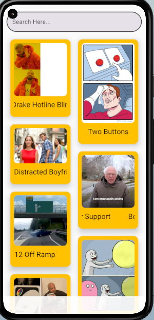
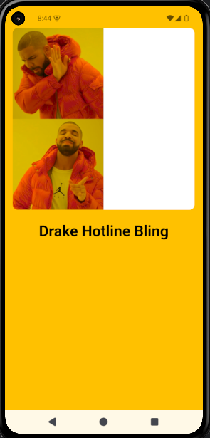

# 🖼️ Meme Explorer App

یک اپلیکیشن ساده اندرویدی با استفاده از **Jetpack Compose** که لیستی از میم‌ها (memes) را از یک API عمومی دریافت و نمایش می‌دهد. کاربران می‌توانند بین میم‌ها جست‌وجو کرده و با کلیک روی هر آیتم، وارد صفحه‌ی جزییات شوند.

---

## 🚀 ویژگی‌ها

- دریافت لیست میم‌ها از اینترنت (API)
- جست‌وجوی بلادرنگ در بین آیتم‌ها
- نمایش تصاویر در شبکه staggered grid
- صفحه‌ی جزییات برای هر میم
- مدیریت خطاهای شبکه و وضعیت لودینگ
- طراحی ساده و جذاب با Jetpack Compose

---

## 🧰 تکنولوژی‌های استفاده‌شده

- Kotlin
- Jetpack Compose
- Retrofit
- Navigation Compose
- Coil (برای لود تصاویر)
- ViewModel (در نسخه‌ی بعدی اضافه می‌شود)
- Material3

---

## 🧪 نحوه اجرا

1. پروژه را کلون کنید:

   ```bash
   git clone https://github.com/your-username/meme-explorer.git
   ```

2. آن را در Android Studio باز کنید.

3. Run ➝ روی Emulator یا Device واقعی تست کنید.

---

## 📡 API مورد استفاده

از API رایگان [ImgFlip](https://api.imgflip.com/get_memes) برای دریافت میم‌ها استفاده شده است.

---

## 📸 اسکرین‌شات‌ها

> اسکرین‌شات‌ها را در مسیر `images/` قرار دهید و به‌صورت زیر در پروژه نمایش دهید:

```html


```

---

## 📁 ساختار پوشه‌ها

```
├── ApiService/           # اینترفیس Retrofit
├── Retrofit/             # ساخت RetrofitInstance
├── Util/                 # مقادیر ثابت (مثل BASE_URL)
├── nav/                  # Navigation Graph
├── MainActivity.kt
├── Composables.kt        # کامپوزبل‌های مختلف مثل MemItem، SearchViewApp
├── README.md
```

---

## 🧩 پیشنهادات توسعه آتی

- اضافه کردن ViewModel و State Handling بهتر (MVVM)
- Paging برای دریافت لیست طولانی‌تر
- Save کردن علاقه‌مندی‌ها (Favorites)
- تست‌های واحد (Unit Tests)

---

## 👨‍💻 توسعه‌دهنده

**علیرضا حلوای فرد**  
📧 ahf.programmer@gmail.com  
🌐 [github.com/android24h](https://github.com/android24h)

---

## 📃 مجوز

این پروژه تحت لایسنس MIT منتشر شده است.